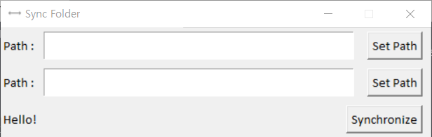

# sync_folder

 

Synchronize folder recursively using file names.
It was built to synchronize between two folders using file names recursively, in a lightweight way.
 
The usage and feature is rather simple, set two paths, and click the button.
 

Up to this point, The applications are developed in Python, ``core.py`` and ``sync_folder.py``.
 
executing the script ``sync_folder.py`` will shown to you with ``tkinter`` GUI.
 
but you can also execute ``sync_folder.py`` with CLI. Just type in two paths in separate lines.
 
Please ignore any other source codes. those are obsolete.
